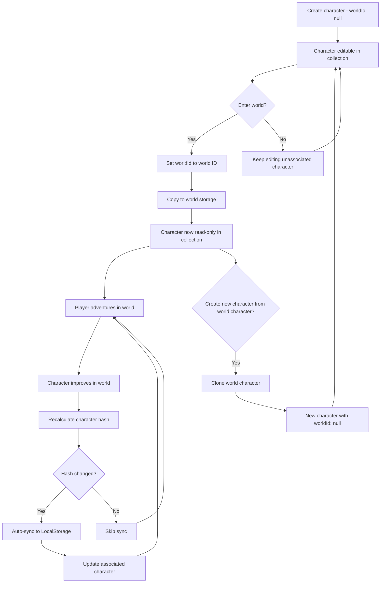

# Character System

*See [`../CLAUDE.md`](../CLAUDE.md) for general development guidelines*

## Overview

The Character System manages Hollow World RPG characters, including creation, storage, versioning, and lifecycle management. Characters can exist independently and be used across multiple TextCraft worlds.

## 📋 Character Structure

### ICharacter Interface

```typescript
interface ICharacter {
    // Identity
    id: string;                // UUID (primary identifier)
    name: string;              // Character name
    description: string;       // Character background/description

    // Core Stats
    rank: number;              // Character level (1-10)
    attributes: IAttributes;   // Brawn, Finesse, Grit, Wits, Moxie, Luck

    // Resources
    hp: { current: number; max: number };
    dust: number;              // Currency

    // Skills & Abilities
    skills: Map<string, number>;     // Skill levels
    fields: IField[];                // Field specializations
    benefits: IBenefit[];            // Character benefits

    // Equipment & Inventory
    equipment: IEquipment[];

    // Character State
    hollow: IHollowTracker;    // Hollow corruption tracking

    // World Association
    worldId: string | null;    // ID of world this character is tied to
                               // null = not associated with any world (editable)
                               // string = tied to specific world (read-only in collection)

    // Metadata
    version: string;           // App version (for migrations)
    createdAt: Date;
    updatedAt: Date;
    isFrozen: boolean;         // Lock character from edits
}
```

### IAttributes Interface

```typescript
interface IAttributes {
    brawn: number;    // Physical strength
    finesse: number;  // Dexterity/agility
    grit: number;     // Endurance/toughness
    wits: number;     // Intelligence/perception
    moxie: number;    // Charisma/willpower
    luck: number;     // Fortune/fate
}

type AttributeType = keyof IAttributes;
```

### IField Interface

```typescript
interface IField {
    id: string;
    name: string;
    description: string;
    level: number;
    skills: IFieldSkillEntry[];  // Skills gained from this field
}
```

### IBenefit Interface

```typescript
interface IBenefit {
    id: string;
    name: string;
    description: string;
    effect: string;
}
```

## 🎮 Character Progression

### Rank System

- **Starting Rank:** 1
- **Maximum Rank:** 10
- **Rank determines:**
  - Total XP: `10 * rank` (10, 20, 30... 100)
  - Total Attribute Chips: `15 + rank` (16, 17, 18... 25)

### Attribute Chip Economy

```typescript
// Total chips available at rank
const totalChips = 15 + character.rank;

// Cost per attribute level
const costs = [0, 1, 3, 6, 10];

// Total spent
const spentChips = Object.values(character.attributes)
    .reduce((sum, level) => sum + costs[level], 0);

// Available chips
const availableChips = totalChips - spentChips;
```

### XP and Advancement

- Characters can spend XP on:
  - Skills (costs exceed attribute chips)
  - Fields (specialized skill groups)
  - Benefits (special abilities)
- Rank increases unlock more resources

## 💾 Storage & Versioning

### LocalStorage Structure

**Key:** `hollow-character-{uuid}` (per profile)

```json
{
  "id": "550e8400-e29b-41d4-a716-446655440000",
  "name": "Jack Morgan",
  "version": "0.1.0",
  "rank": 3,
  "attributes": {
    "brawn": 3,
    "finesse": 2,
    "grit": 3,
    "wits": 2,
    "moxie": 2,
    "luck": 1
  },
  "hp": { "current": 18, "max": 18 },
  "skills": {},
  "fields": [],
  "benefits": [],
  "equipment": [],
  "hollow": {
    "level": 0,
    "scars": [],
    "newMoonMarks": 0
  },
  "dust": 10,
  "createdAt": "2025-10-31T12:00:00Z",
  "updatedAt": "2025-10-31T12:00:00Z",
  "isFrozen": false
}
```

### Character Versioning

**See [`storage.md`](storage.md#-character-version-compatibility) for complete versioning details**

#### Schema Evolution

```typescript
interface ICharacterSchema {
    version: string;
    description: string;
    fieldFormat: 'legacy' | 'skillEntries';
}

const CHARACTER_SCHEMAS: ICharacterSchema[] = [
    {
        version: "0.1.0",
        description: "Initial character schema",
        fieldFormat: 'legacy'
    },
    {
        version: "0.2.0",
        description: "Added skillEntries format for fields",
        fieldFormat: 'skillEntries'
    }
];
```

#### Migration Function

```typescript
function upgradeCharacter(character: any): ICharacter {
    let current = character;
    const targetVersion = getCurrentVersion();

    // Upgrade through each schema version
    while (current.version !== targetVersion) {
        const currentIndex = findSchemaIndex(current.version);
        const upgrader = getUpgrader(currentIndex);
        current = upgrader(current);
    }

    return current;
}
```

## 🔄 Character Lifecycle

### Creation Workflow

1. User clicks "New Character" button
2. CharacterFactory creates default character
3. Character sheet opens in creation mode
4. User edits attributes, skills, etc.
5. User clicks "Yep" to save
6. Character saved to LocalStorage
7. Navigate to character view with UUID in URL

### Editing Workflow

1. Load character from storage using UUID
2. Display in character sheet (editable mode)
3. Track changes in memory (not persisted)
4. "Nope" button → Revert to saved version
5. "Yep" button → Save changes and update history

### Save/Load Details

**See [`storage.md`](storage.md#character-saveload-workflow) for complete workflow**

Key points:
- Live editing without auto-save
- "Yep" button saves and updates history
- "Nope" button reverts to last saved
- Browser history integration for back/forward navigation

## 🌐 Character in Multiple Worlds

### Character Ownership Model

**IMPORTANT:** A character can only be associated with ONE world at a time.

```
Unassociated Character (LocalStorage, worldId: null)
    ↓ (enter world - character becomes tied)
Associated Character (LocalStorage, worldId: "world-123") [READ-ONLY]
    ↓ (automatic sync on changes)
World Character Instance (MudStorage) [AUTHORITATIVE]
```

**Character States:**
- **Unassociated (worldId: null):** Can be edited freely, can enter a world
- **Associated (worldId: "xyz"):** Tied to specific world, read-only in collection, syncs from world
- **World Instance:** Authoritative copy in world database, can be improved in-world

### Per-World Character Instances

When a character enters a TextCraft world:

1. **Verify character is unassociated**
   ```typescript
   if (character.worldId !== null) {
       throw new Error('Character already tied to a world');
   }
   ```

2. **Associate character with world**
   ```typescript
   character.worldId = worldId;
   await saveCharacter(character);
   ```

3. **One-time copy of character to world storage**
   ```typescript
   // This is a SNAPSHOT, not a live link
   const worldCharacter: IWorldCharacter = {
       characterId: character.id,  // Reference to original
       character: deepClone(character),  // Copy at entry time
       characterHash: calculateHash(character)
   };
   ```

4. **Create world connection**
   ```typescript
   const connection: IWorldConnection = {
       peer: myPeerId,  // or null for owner
       characterId: character.id,
       thingId: assignedThingId
   };
   ```

5. **Sync character to Thing properties**
   ```typescript
   function syncCharacterToThing(character: ICharacter, thing: Thing) {
       thing.properties.strength = character.attributes.brawn;
       thing.properties.dexterity = character.attributes.finesse;
       thing.properties.hp = character.hp.current;
       thing.properties.maxHp = character.hp.max;
       // ... etc
   }
   ```

### Character Sync Flow

**Character lifecycle with world association:**



**Key principles:**
- **One world per character:** Character can only be tied to ONE world (worldId field)
- **Unassociated = editable:** Characters with worldId: null can be edited freely
- **Associated = read-only:** Characters with worldId set are read-only in collection
- **Automatic sync:** World changes sync to associated character automatically
- **Hash optimization:** Only sync when character hash changes
- **One-way sync:** World → LocalStorage (player can't edit associated characters)
- **Create from world:** Clone world character to create new unassociated character
- **Permanent association:** Once tied to a world, character stays tied (or create new from it)

### Integrity Verification

```typescript
function verifyCharacterIntegrity(
    worldCharacter: IWorldCharacter
): boolean {
    const calculatedHash = calculateHash(worldCharacter.character);
    return calculatedHash === worldCharacter.characterHash;
}

function calculateHash(character: ICharacter): string {
    const normalized = JSON.stringify(
        character,
        Object.keys(character).sort()
    );
    return sha256(normalized);
}
```

## 🎯 Character Management UI

### Character List View

**URL:** `/characters`

Features:
- List all characters for current profile
- Create new character button
- Edit/delete existing characters
- Character card preview (name, rank, portrait)
- Filter/search characters

### Character Sheet View

**URL:** `/character/:uuid`

Features:
- Full character sheet display
- Attributes with chip economy display
- Skills and fields management
- Equipment and inventory
- Hollow tracker
- **World association display:**
  - **If associated (worldId !== null):**
    - Show "Tied to: [World Name]" banner at top
    - Display entire sheet as read-only
    - "Create New Character" button (clone as unassociated)
    - Click world name to navigate to that world
  - **If unassociated (worldId === null):**
    - Fully editable
    - Save ("Yep") and revert ("Nope") buttons
    - Can enter any world
- Export character as JSON

**See [`ui.characters.md`](ui.characters.md) for UI specifications**

## 🧮 Character Calculations

### Derived Stats

```typescript
class CharacterCalculations {
    // HP calculation
    static calculateMaxHP(character: ICharacter): number {
        return character.attributes.grit * 6;
    }

    // Attribute cost calculation
    static calculateAttributeCost(level: number): number {
        const costs = [0, 1, 3, 6, 10];
        return costs[level] || 0;
    }

    // Total chips available
    static getTotalAttributeChips(rank: number): number {
        return 15 + rank;
    }

    // Available chips (unused)
    static getAvailableAttributeChips(character: ICharacter): number {
        const total = this.getTotalAttributeChips(character.rank);
        const spent = Object.values(character.attributes)
            .reduce((sum, level) =>
                sum + this.calculateAttributeCost(level), 0
            );
        return total - spent;
    }
}
```

### Validation

```typescript
class CharacterValidation {
    static validateCharacterCreation(
        character: ICharacter
    ): string[] {
        const errors: string[] = [];

        // Name required
        if (!character.name?.trim()) {
            errors.push("Character name required");
        }

        // Attributes in valid range
        for (const [attr, value] of Object.entries(character.attributes)) {
            if (value < 0 || value > 4) {
                errors.push(`${attr} must be 0-4`);
            }
        }

        // Chip economy validation
        const available = CharacterCalculations
            .getAvailableAttributeChips(character);
        if (available < 0) {
            errors.push("Too many attribute chips spent");
        }

        return errors;
    }
}
```

## 🧪 Testing

### Character Creation Tests
- Create new character with defaults
- Validate attribute chip economy
- Verify version stamping
- Test character factory

### Character Loading Tests
- Load character from storage
- Upgrade old character versions
- Handle corrupted data
- Validate loaded character

### Character Editing Tests
- Make edits without saving
- Revert changes ("Nope" button)
- Save changes ("Yep" button)
- Browser history integration

### Character World Integration Tests
- Create unassociated character (worldId: null)
- Verify unassociated character is editable
- Enter world with character and verify worldId gets set
- Verify character becomes read-only after association
- Update world character and verify automatic sync to LocalStorage
- Test hash-based sync (skip when hash unchanged)
- Verify sync triggers periodically while in world
- Verify sync on world exit
- Test "Create New Character" from associated character (clone without worldId)
- Verify attempting to enter world with associated character fails
- Test integrity verification on sync

## 📚 Related Specifications

- [`storage.md`](storage.md) - Storage patterns and versioning
- [`friends.md`](friends.md) - Friend world character tracking
- [`ui.characters.md`](ui.characters.md) - Character management UI
- [`integrate-textcraft.md`](integrate-textcraft.md) - Character-Thing sync
- [`character-sheet-plan.md`](character-sheet-plan.md) - Sheet design details
