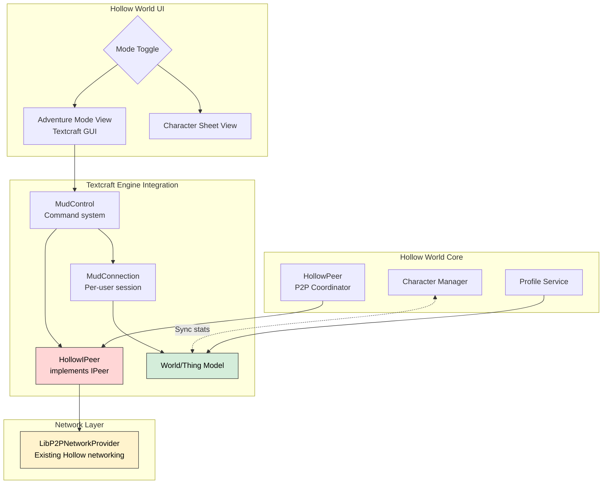
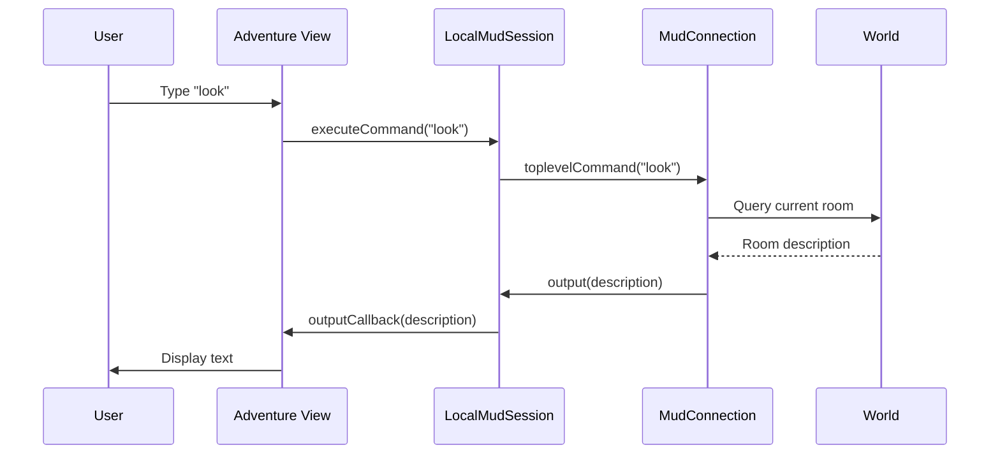
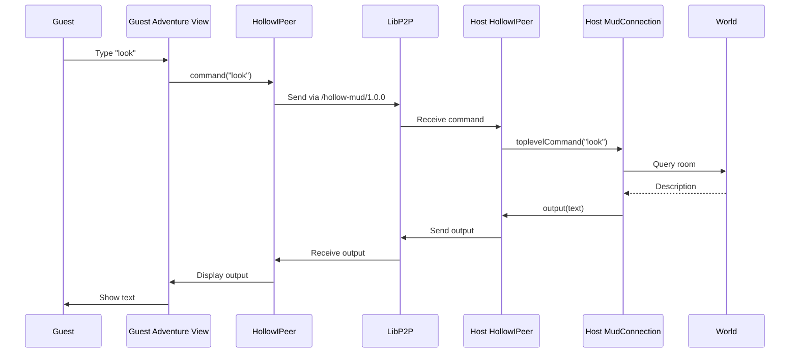
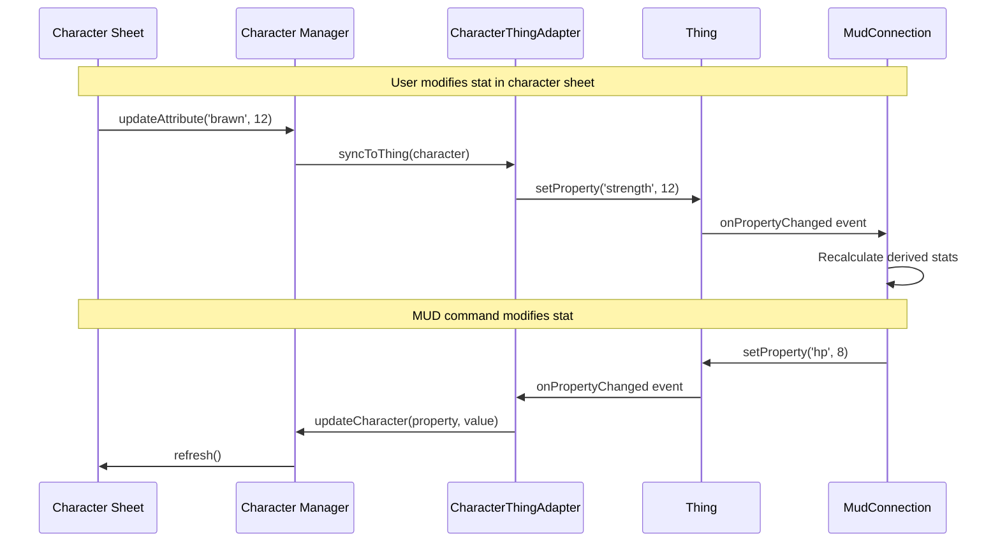

# Textcraft Integration Plan for Hollow World

**Plan Version:** 2.1
**Date:** 2025-10-19
**Last Updated:** 2025-10-26
**Status:** Phase 2 Complete - Phase 2.5 In Progress

---

## Executive Summary

This plan integrates Textcraft's proven P2P text-based MUD engine into Hollow World RPG to add a **text-based adventure mode** alongside the existing graphical character sheet interface. The integration leverages Textcraft's `IPeer` abstraction to replace libp2p direct streams with Hollow's existing LibP2P infrastructure.

### Key Integration Points

1. **Network Layer**: Implement Textcraft's `IPeer` interface using Hollow's `LibP2PNetworkProvider`
2. **MUD Engine**: Import Textcraft's `MudConnection`, `World`, and `Thing` model as-is
3. **UI Mode**: Add "Adventure Mode" toggle to switch between character sheet and text MUD
4. **World Sync**: Sync Hollow character stats with Textcraft Thing properties

---

## Table of Contents

1. [Architecture Overview](#architecture-overview)
2. [Integration Strategy](#integration-strategy)
3. [Implementation Phases](#implementation-phases)
4. [File Structure](#file-structure)
5. [Component Details](#component-details)
6. [Data Flow](#data-flow)
7. [Testing Strategy](#testing-strategy)
8. [Migration Path](#migration-path)

---

## Architecture Overview

### Current State

**Textcraft:**
- TypeScript-based text MUD engine
- Uses `IPeer` abstraction for networking
- Default implementation: `mudproto.ts` using libp2p direct streams
- Components:
  - `model.ts` - Thing/World model (~2000 lines)
  - `mudcontrol.ts` - Command system & MudConnection (~2500 lines)
  - `peer.ts` - IPeer interface
  - `gui.ts` - Text-based UI (~1000 lines)

**Hollow World:**
- TypeScript RPG with graphical character sheets
- Uses LibP2P for P2P networking via `HollowPeer` and `LibP2PNetworkProvider`
- Components:
  - Character management
  - Dice rolling
  - Combat system
  - Profile/storage system

### Integration Architecture



---

## Integration Strategy

### Approach: Clean Layer Integration

**DO:**
- ✅ Implement `IPeer` interface using Hollow's existing LibP2P infrastructure
- ✅ Import Textcraft's core engine (`model.ts`, `mudcontrol.ts`) as separate modules
- ✅ Create new "Adventure Mode" UI component
- ✅ Sync Hollow character data with Textcraft Thing properties
- ✅ Use Hollow's profile/storage system for World persistence

**DON'T:**
- ❌ Modify Textcraft's core engine code (keep it pristine for updates)
- ❌ Replace Hollow's existing LibP2P setup
- ❌ Mix Textcraft GUI directly into character sheet
- ❌ Duplicate P2P infrastructure

### Why This Approach Works

1. **Textcraft's IPeer abstraction** was designed for exactly this - custom protocol implementations
2. **Hollow already has LibP2P** - we just need to adapt it to IPeer interface
3. **Separate concerns** - Character sheet and text adventure are distinct modes
4. **Data sync** - Hollow character stats flow into Textcraft Things as properties

---

## Implementation Phases

### Phase 1: Foundation (Week 1) ✅ **COMPLETED**

**Goal:** Import Textcraft core and implement basic IPeer adapter

**Status:** Complete - See `specs/integration/textcraft-phase1-completion.md` for details

#### Tasks:

1. **Import Textcraft Core**
   ```
   src/textcraft/
   ├── model.ts          # Thing/World model (copy from Textcraft)
   ├── mudcontrol.ts     # Command system (copy from Textcraft)
   ├── peer.ts           # IPeer interface (copy from Textcraft)
   └── index.ts          # Re-exports
   ```

2. **Create HollowIPeer Adapter**
   ```typescript
   // src/textcraft/hollow-peer.ts
   import { IPeer } from './peer'
   import { LibP2PNetworkProvider } from '../p2p/LibP2PNetworkProvider'

   export class HollowIPeer implements IPeer {
     constructor(private networkProvider: LibP2PNetworkProvider) {}

     // Implement all 12 IPeer methods...
   }
   ```

3. **Unit Tests**
   - Test HollowIPeer basic operations
   - Test createConnection()
   - Test command routing

**Success Criteria:**
- ✅ Textcraft core imports without errors
- ✅ HollowIPeer implements all IPeer methods
- ✅ Can create MudConnection instances
- ✅ All unit tests pass

**Completion Notes:**
- Implemented in commit: ad6ebf5
- Files created: `src/textcraft/hollow-peer.ts`, `test/HollowIPeer.test.ts`
- All 21 unit tests passing
- Full completion report: `specs/integration/textcraft-phase1-completion.md`

### Phase 2: Adventure Mode UI (Week 2) ✅ **COMPLETED**

**Goal:** Create text-based adventure UI component

**Status:** Complete - AdventureView component implemented with template-based UI

#### Tasks:

1. **Create AdventureView Component**
   ```
   src/components/adventure/
   ├── adventure-view.ts        # Main view controller
   ├── adventure-view.html      # Template
   ├── adventure-view.css       # Styling (western theme)
   └── adventure-view.test.ts   # Tests
   ```

2. **UI Features**
   - Text output area (scrollable, western-styled)
   - Command input field
   - Command history (up/down arrows)
   - Mode toggle button (switch to character sheet)
   - Connection status indicator

3. **Integration Points**
   ```typescript
   // In main.ts
   const adventureView = new AdventureView(hollowPeer)
   viewManager.registerView('adventure', adventureView)
   ```

**Success Criteria:**
- ✅ Can display text output
- ✅ Can input commands
- ✅ Command history works
- ✅ Mode toggle switches views
- ✅ Western theme consistent

**Completion Notes:**
- Implemented in commit: 3446e38
- Files created: `src/ui/AdventureView.ts`, template files, `src/styles/AdventureView.css`
- Integrated with main.ts and view manager
- Uses HollowIPeer adapter for P2P communication
- Follows project template principles (HTML templates, no inline strings)

### Phase 2.5: Solo Mode (Week 2.5) ⏳ **IN PROGRESS**

**Goal:** Get single-player/local mode working without P2P networking

**Status:** In Progress - Enables testing MUD engine before network complexity

#### Tasks:

1. **Create Local MudConnection**
   ```typescript
   // In src/textcraft/local-session.ts
   export class LocalMudSession {
     private mudConnection: MudConnection | null = null
     private world: World | null = null

     async loadWorld(worldData: string): Promise<void> {
       // Parse YAML world data
       // Create World instance
       // Create local MudConnection (non-networked)
       this.mudConnection = createConnection(
         this.world,
         (output: string) => this.handleOutput(output),
         false // remote = false (local play)
       )
     }

     executeCommand(cmd: string): void {
       if (!this.mudConnection) {
         throw new Error('No world loaded')
       }
       this.mudConnection.toplevelCommand(cmd)
     }

     private handleOutput(text: string): void {
       // Send output to AdventureView
       this.outputCallback(text)
     }
   }
   ```

2. **Wire AdventureView to Local Session**
   ```typescript
   // Update src/ui/AdventureView.ts
   import { LocalMudSession } from '../textcraft/local-session'

   export class AdventureView {
     private localSession: LocalMudSession

     async initializeSoloMode() {
       this.localSession = new LocalMudSession(
         (output) => this.addOutput(output)
       )

       // Load default world
       const worldData = await this.loadWorldFile('Dusty Creek.yaml')
       await this.localSession.loadWorld(worldData)
     }

     private async handleCommand() {
       const cmd = this.inputField.value.trim()
       if (!cmd) return

       this.addOutput(`> ${cmd}`, 'command')
       this.localSession.executeCommand(cmd)

       this.inputField.value = ''
     }
   }
   ```

3. **Create Simple Test World**
   ```yaml
   # worlds/test-room.yaml
   world:
     name: "Test Room"
     version: "1.0"

   things:
     - id: entrance
       name: "Dusty Entrance"
       kind: room
       description: >
         You stand at the entrance to a dusty frontier town.
         A wooden sign creaks in the wind. There's a path leading north.
       properties:
         exits:
           north: main_street

     - id: main_street
       name: "Main Street"
       kind: room
       description: >
         The main street is quiet. Tumbleweed rolls past.
         The saloon is to the west, and you can go south back to the entrance.
       properties:
         exits:
           south: entrance
           west: saloon

     - id: saloon
       name: "Silver Dollar Saloon"
       kind: room
       description: >
         The saloon is dimly lit. A piano sits silent in the corner.
         The exit is to the east.
       properties:
         exits:
           east: main_street

     - id: sign
       name: "Wooden Sign"
       kind: thing
       description: "Welcome to Dusty Creek - Population: Dwindling"
       location: entrance
   ```

4. **Add World Loading**
   ```typescript
   // src/textcraft/world-loader.ts
   import { World, Thing } from './model'
   import * as yaml from 'yaml' // or js-yaml

   export class WorldLoader {
     async loadFromYAML(yamlText: string): Promise<World> {
       const data = yaml.parse(yamlText)

       const world = new World()
       world.name = data.world.name
       world.version = data.world.version

       // Create all Things
       for (const thingData of data.things) {
         const thing = new Thing(thingData.id)
         thing.name = thingData.name
         thing.kind = thingData.kind
         thing.properties.description = thingData.description

         // Copy all properties
         if (thingData.properties) {
           Object.assign(thing.properties, thingData.properties)
         }

         world.addThing(thing)
       }

       // Set up locations
       for (const thingData of data.things) {
         if (thingData.location) {
           const thing = world.getThing(thingData.id)
           const location = world.getThing(thingData.location)
           thing.moveTo(location)
         }
       }

       return world
     }
   }
   ```

5. **Update Splash Screen and Adventure View UI**

   **Splash Screen Button Changes:**
   - Change "Join Game" → "Join"
   - Remove "Start Game" button (no longer needed for Phase 2.5)
   - Change "Adventure Mode" → "🤠 Games" (keep cowboy emoji)
   - Move "🤠 Games" button to appear right after "Join" button
   - Button order: `[ Characters ] [ Join ] [ 🤠 Games ] [ Settings ]`

   **Adventure View Updates:**

   **Banner Layout** (single-line header):
   ```
   [World Name] [flexible space] [➕ New] [World Selector Dropdown] [Mode: Solo] [⬅️ Back]
   ```
   - **World Name Display** (left side): Shows current world name without label
   - **Flexible Space**: Pushes controls to the right
   - **➕ New Button**: Opens modal to create a new world
     - Clicking opens a modal to create a new world with a name
     - Creates a fresh empty world with standard prototypes
     - Switches to the new world immediately
   - **World Selector Dropdown**: Load/switch between existing worlds
     - No "Load World:" label (use title attribute for accessibility)
     - Shows all available worlds from storage
   - **Mode Indicator**: Shows current session mode (Solo/Host/Guest)
     - Visual indicator (● colored dot) + text
   - **Back Button** (right side): Returns to main menu

   - Keep multiplayer hosting UI hidden for now (Phase 3)

6. **World Management Interface with Routing** ✅ **COMPLETED**

   Implemented comprehensive world management interface with world list view, settings editor, deletion functionality, and URL-based routing.

   **Files Created/Modified:**
   - `public/templates/adventure/world-list-view.html` - World list overlay view template
   - `public/templates/adventure/world-list-item.html` - Individual world item template
   - `public/templates/adventure/world-settings-modal.html` - Main settings modal template
   - `public/templates/adventure/user-item.html` - User list item template
   - `public/templates/adventure/delete-world-modal.html` - Delete confirmation modal template
   - `public/templates/adventure/adventure-view.html` - Updated header (removed gear button and selector)
   - `src/styles/AdventureView.css` - Added world list view, modal, user management, and delete confirmation styles
   - `src/ui/AdventureView.ts` - Implemented world list view, modal functionality, world persistence, deletion, and router integration
   - `src/main.ts` - Added `/adventure/worlds` route and router integration

   **Routing Implementation:**
   - **`/adventure`** - Main adventure view with current world loaded
   - **`/adventure/worlds`** - World list view overlay displayed
   - **Browser history integration** - Back/forward buttons work correctly between routes
   - **Deep linking support** - Direct navigation to `/adventure/worlds` works on page load
   - **Router-based navigation** - Clicking world name uses `router.navigate()` instead of direct DOM manipulation
   - **Fallback support** - Direct toggle still works if router is not available

   **World List View Features:**
   - **Clickable world name** - Click current world name to navigate to `/adventure/worlds`
   - Full-screen overlay displays all available worlds
   - Header: "🌵 Your Worlds" title with "➕ New World" button
   - **World list items** - Each world shows:
     - ⭐ **Start button** - Switch to world and navigate back to `/adventure`
     - **World name** - Displayed prominently in center
     - ⚙️ **Edit button** - Open world settings modal (navigates to `/adventure` first)
     - 💀 **Delete button** - Show delete confirmation modal
   - Automatically navigates to `/adventure` when switching to a world
   - Western frontier themed with brown/gold color scheme
   - Responsive layout adapts to mobile screens

   **World Settings Modal Features:**
   - Edit world name and description
   - User management:
     - Add/remove users dynamically
     - Set username, password, and admin flag for each user
     - Grid layout (username, password, admin checkbox, remove button)
   - **Delete world functionality:**
     - Delete World button (red/warning styled) in settings modal
     - Confirmation modal prevents accidental deletion
     - Shows world name in confirmation message
     - Automatic world switching after deletion:
       - If other worlds exist, switches to first available world
       - If no worlds remain, creates new default world automatically
     - Refreshes world list view if visible after deletion
   - Transaction-based persistence via `world.doTransaction()`
   - Form validation (world name required, at least one user)
   - Success/error feedback messages
   - Western frontier theme styling consistent with AdventureView

   **Key Methods (AdventureView.ts):**
   - `toggleWorldListView()` - Navigate between `/adventure` and `/adventure/worlds` using router
   - `showWorldListViewFromRoute()` - Show world list when navigating to `/adventure/worlds` route
   - `showWorldListView()` - Display world list with all worlds
   - `hideWorldListView()` - Close world list overlay
   - `renderWorldListView()` - Populate world list with all available worlds
   - `renderWorldListItem()` - Render individual world item with buttons
   - `startWorld()` - Switch to selected world and navigate to `/adventure`
   - `editWorld()` - Navigate to `/adventure` and open settings modal for selected world
   - `deleteWorldFromList()` - Show delete confirmation for selected world
   - `showWorldSettingsModal()` - Load and display settings modal
   - `loadWorldSettings()` - Populate modal with current world data
   - `loadUsers()` - Render users list from world.userCache
   - `addUser()` - Add new empty user row
   - `saveWorldSettings()` - Persist changes (name, description, users)
   - `collectUsersFromForm()` - Extract user data from form inputs
   - `showDeleteConfirmationModal()` - Display delete confirmation dialog
   - `hideDeleteConfirmationModal()` - Close delete confirmation dialog
   - `deleteWorld()` - Delete current world and switch to another/create default

   **Technical Implementation:**
   - **Router integration** - AdventureView receives router instance via config
   - **Route handlers** in main.ts:
     - `/adventure` → `renderAdventureView(false)` - Show adventure view only
     - `/adventure/worlds` → `renderAdventureView(true)` - Show adventure view + world list
   - **Navigation flow**:
     - Click world name → `router.navigate('/adventure/worlds')`
     - Click start/edit → `router.navigate('/adventure')`
     - Browser back/forward → Router handles popstate events
   - World list view is absolute-positioned overlay (z-index: 100)
   - Toggle state tracked via `isWorldListVisible` boolean
   - Uses TemplateEngine for dynamic rendering (world list, settings modal, delete confirmation)
   - Each world list item gets event listeners for start/edit/delete buttons
   - Leverages `World.replaceUsers()` for atomic user updates
   - Proper transaction context for `world.store()` operations
   - `MudStorage.deleteWorld()` for permanent world removal
   - Automatic fallback: creates new default world if none remain after deletion
   - Scrollable world list and users list for many items
   - CSS Grid layout for user fields (2fr 2fr 1fr columns)
   - Red/warning themed delete button (dark red gradient, crimson border)
   - Delete confirmation modal with warning messages and world name display
   - **Removed** gear button and world selector dropdown from header
   - **Graceful fallback** - Direct DOM toggle if router not available

7. **Testing Solo Mode**
   - Load test world
   - Execute basic commands: `look`, `north`, `south`, `examine sign`
   - Verify output appears correctly
   - Test command history
   - Test error handling for invalid commands

**Success Criteria:**
- ✅ Splash screen buttons updated correctly (Join, 🤠 Games, no Start Game)
- ✅ "🤠 Games" button positioned after "Join" button
- ✅ Can load a YAML world file locally
- ✅ Can create a new world using "+" button
- ✅ New world creation modal works correctly
- ✅ Can switch between multiple worlds
- ✅ **World management interface fully functional** ✅
  - ✅ **Routing implementation working** ✅
    - ✅ `/adventure` route shows adventure view only
    - ✅ `/adventure/worlds` route shows adventure view + world list overlay
    - ✅ Clicking world name navigates to `/adventure/worlds`
    - ✅ Direct navigation to `/adventure/worlds` works on page load
    - ✅ Browser back button navigates from `/adventure/worlds` to `/adventure`
    - ✅ Browser forward button works correctly
    - ✅ URL updates correctly during navigation
  - ✅ **World list view working** ✅
    - ✅ Clicking world name navigates to `/adventure/worlds` route
    - ✅ World list displays all available worlds
    - ✅ "➕ New World" button in world list header
    - ✅ ⭐ Start button switches to selected world and navigates to `/adventure`
    - ✅ ⚙️ Edit button navigates to `/adventure` and opens settings modal
    - ✅ 💀 Delete button shows delete confirmation for selected world
    - ✅ World list closes when navigating to `/adventure`
  - ✅ **World settings editor working** ✅
    - ✅ Can edit world name and description
    - ✅ Can add/remove/edit users
    - ✅ Changes persist correctly via transactions
    - ✅ Form validation prevents invalid data
  - ✅ **Delete world functionality working** ✅
    - ✅ Delete button opens confirmation modal
    - ✅ Confirmation modal shows world name
    - ✅ World deletion removes from storage
    - ✅ Automatic switching to another world
    - ✅ Creates default world if none remain
    - ✅ World list refreshes after deletion if visible
  - ✅ Gear button and world selector removed from header
- ✅ Can execute MUD commands without network
- ✅ Output appears in AdventureView correctly
- ✅ Basic navigation works (go north/south/east/west)
- ✅ Can examine objects
- ✅ Command history functions properly
- ✅ UI shows current location and available exits
- ✅ No dependency on P2P/networking code
- ✅ Proves MUD engine integration before Phase 3

**Dependencies:**
- Requires: Phase 2 (AdventureView UI) ✅
- Blocks: Phase 3 (Network Integration)
- Optional: YAML parser library (js-yaml or yaml)

**Benefits:**
- Validates MUD engine integration early
- Allows UI/UX testing without network complexity
- Provides immediate playable experience
- Reduces risk for Phase 3 (network issues separate from engine issues)
- Enables world design/testing in parallel with network development

### Phase 3: Network Integration (Week 3)

**Goal:** Wire up HollowIPeer to actually work over LibP2P

#### Tasks:

1. **Implement IPeer Methods Using LibP2P**
   ```typescript
   class HollowIPeer implements IPeer {
     async startHosting() {
       // Load or create MUD world
       // Register stream handler for /hollow-mud/1.0.0
       // Create MudConnections for incoming guests
     }

     async joinSession(session: string) {
       // Parse multiaddr
       // Connect to host
       // Open stream on /hollow-mud/1.0.0
       // Send/receive commands
     }

     userThingChanged(thing: Thing) {
       // Broadcast user updates to all connected peers
     }

     command(cmd: string) {
       // Guest: send to host
       // Host: route to appropriate MudConnection
     }
   }
   ```

2. **Protocol Definition**
   ```typescript
   // Message types for /hollow-mud/1.0.0 protocol
   interface MudMessage {
     type: 'command' | 'output' | 'userUpdate' | 'login'
     payload: any
   }
   ```

3. **Stream Handling**
   - Register `/hollow-mud/1.0.0` protocol handler
   - Handle incoming connections (guest → host)
   - Create MudConnection per guest
   - Route messages bidirectionally

**Success Criteria:**
- ✅ Host can start hosting a MUD
- ✅ Guest can connect to host
- ✅ Commands flow host ↔ guest
- ✅ Text output appears in both UIs
- ✅ Multiple guests can connect

### Phase 4: Data Synchronization (Week 4)

**Goal:** Sync Hollow character data with Textcraft Things

#### Tasks:

1. **Character → Thing Mapping**
   ```typescript
   class CharacterThingAdapter {
     syncToThing(character: Character, thing: Thing) {
       thing.properties.strength = character.attributes.brawn
       thing.properties.dexterity = character.attributes.finesse
       thing.properties.hp = character.hp.current
       thing.properties.maxHp = character.hp.max
       // ... etc
     }

     syncFromThing(thing: Thing, character: Character) {
       // Reverse sync (Thing changes → Character)
       // Useful for MUD-based stat modifications
     }
   }
   ```

2. **Bidirectional Sync**
   - Character sheet changes → update Thing properties
   - Thing property changes → update character (via events)
   - Conflict resolution (last-write-wins initially)

3. **Persistence Integration**
   ```typescript
   // Save MUD worlds using Hollow's profile storage
   profileService.setItem('mud-world-' + worldName, worldData)
   ```

**Success Criteria:**
- ✅ Character stats appear as Thing properties
- ✅ Changes in character sheet sync to MUD
- ✅ Changes in MUD sync to character sheet
- ✅ Worlds persist across sessions
- ✅ Profile switching works correctly

### Phase 5: World Creation & Examples (Week 5)

**Goal:** Create Hollow-themed MUD worlds

#### Tasks:

1. **Convert Textcraft Examples**
   - Adapt Purgatory.yaml to Hollow theme (western frontier)
   - Create Hollow-specific examples:
     - `Dusty Creek.yaml` - Starter town
     - `The Badlands.yaml` - Dangerous wilderness
     - `Sheriff's Office.yaml` - Tutorial area

2. **Hollow-Specific Extensions**
   ```typescript
   // Dice rolling in MUD
   @js rollDice('1d20+3')

   // Combat in text mode
   @js combat(target)

   // Inventory ↔ Character sheet
   @js syncInventory()
   ```

3. **World Builder**
   - GUI for creating/editing MUD worlds
   - YAML export/import
   - Visual room layout (optional)

**Success Criteria:**
- ✅ 3+ Hollow-themed example worlds
- ✅ Worlds include Hollow mechanics (dice, combat)
- ✅ Can load/save custom worlds
- ✅ Examples demonstrate key features

### Phase 6: Polish & Testing (Week 6)

**Goal:** Production-ready integration

#### Tasks:

1. **Comprehensive Testing**
   - Unit tests for all components
   - Integration tests for P2P flows
   - UI tests for adventure mode
   - Load testing (10+ concurrent users)

2. **Error Handling**
   - Network disconnections
   - Invalid commands
   - Sync conflicts
   - Storage corruption

3. **Documentation**
   - User guide for adventure mode
   - Developer guide for extending MUDs
   - API docs for HollowIPeer
   - Flow diagrams

4. **Performance Optimization**
   - Lazy loading of MUD engine
   - Message batching
   - Output throttling
   - Memory management

**Success Criteria:**
- ✅ All tests passing
- ✅ Error handling robust
- ✅ Documentation complete
- ✅ Performance acceptable

---

## File Structure

```
HollowWorld/
├── src/
│   ├── textcraft/                      # Textcraft integration
│   │   ├── model.ts                    # Thing/World model (from Textcraft)
│   │   ├── mudcontrol.ts               # Command system (from Textcraft)
│   │   ├── peer.ts                     # IPeer interface (from Textcraft)
│   │   ├── hollow-peer.ts              # HollowIPeer implementation
│   │   ├── character-thing-adapter.ts  # Character ↔ Thing sync
│   │   ├── storage-adapter.ts          # Hollow storage → MUD worlds
│   │   └── index.ts                    # Module exports
│   │
│   ├── components/
│   │   └── adventure/
│   │       ├── adventure-view.ts       # Main adventure UI
│   │       ├── adventure-view.html     # UI template
│   │       ├── adventure-view.css      # Western-themed styling
│   │       └── adventure-view.test.ts  # Tests
│   │
│   ├── p2p/
│   │   ├── LibP2PNetworkProvider.ts    # Existing (unchanged)
│   │   └── protocols/
│   │       └── mud-protocol.ts         # /hollow-mud/1.0.0 handler
│   │
│   └── main.ts                         # Updated with adventure mode
│
├── worlds/                             # MUD world files
│   ├── Dusty Creek.yaml
│   ├── The Badlands.yaml
│   └── Sheriff's Office.yaml
│
└── specs/
    ├── integrate-textcraft-2.md        # This file
    └── textcraft/                      # Cached Textcraft docs
        ├── developing.md
        ├── architecture.md
        └── ipeer-flow-diagram.md
```

---

## Component Details

### HollowIPeer Implementation

**File:** `src/textcraft/hollow-peer.ts`

```typescript
import { IPeer, PeerID } from './peer'
import { Thing, MudStorage } from './model'
import { createConnection, MudConnection } from './mudcontrol'
import { LibP2PNetworkProvider } from '../p2p/LibP2PNetworkProvider'

export class HollowIPeer implements IPeer {
  currentVersionID: string = '1.0.0'
  versionID: string = '1.0.0'

  private networkProvider: LibP2PNetworkProvider
  private mudConnections: Map<PeerID, MudConnection> = new Map()
  private isHost: boolean = false
  private hostPeerID: PeerID | null = null

  constructor(networkProvider: LibP2PNetworkProvider) {
    this.networkProvider = networkProvider
  }

  init(app: any): void {
    // Called by textcraft.ts initialization
    console.log('HollowIPeer initialized')
  }

  async start(storage: MudStorage): void {
    // Register stream handler for /hollow-mud/1.0.0
    this.networkProvider.registerProtocolHandler(
      '/hollow-mud/1.0.0',
      this.handleIncomingStream.bind(this)
    )
  }

  reset(): void {
    // Close all MudConnections
    for (const mudcon of this.mudConnections.values()) {
      mudcon.close()
    }
    this.mudConnections.clear()
    this.isHost = false
    this.hostPeerID = null
  }

  connectString(): string {
    // Return multiaddr for direct connection
    return this.networkProvider.getMultiaddr()
  }

  relayConnectString(): string {
    // Return relay multiaddr (if using relay)
    return this.networkProvider.getRelayMultiaddr()
  }

  async startHosting(): void {
    this.isHost = true
    // Load or create world
    // Display connection string
    // Wait for guests to connect
  }

  async joinSession(session: string): void {
    this.isHost = false
    // Parse multiaddr
    // Connect to host
    // Begin login
  }

  startRelay(): void {
    throw new Error('Relay mode not supported in Hollow')
  }

  hostViaRelay(sessionID: string): void {
    throw new Error('Relay hosting not supported in Hollow')
  }

  userThingChanged(thing: Thing): void {
    if (!this.isHost) return

    // Find peer ID for this thing
    const peerID = this.findPeerIDForThing(thing)
    if (!peerID) return

    // Broadcast user update to all other peers
    const message = {
      type: 'userUpdate',
      peerID,
      name: thing.name,
      properties: thing.properties
    }

    this.broadcast(message, peerID)
  }

  command(cmd: string): void {
    if (this.isHost) {
      // Route to local MudConnection (host playing too)
      // This is an edge case - usually guests send commands
    } else {
      // Send to host
      this.sendToHost({
        type: 'command',
        text: cmd
      })
    }
  }

  // Private helper methods

  private async handleIncomingStream(stream: any, connection: any) {
    // New guest connecting
    const peerID = connection.remotePeer.toString()

    // Create MudConnection for this guest
    const mudcon = createConnection(
      this.currentWorld,
      (text: string) => {
        // Send output back to guest
        this.sendToGuest(peerID, {
          type: 'output',
          text
        })
      },
      true // remote = true
    )

    this.mudConnections.set(peerID, mudcon)

    // Handle incoming messages from guest
    this.setupStreamListener(stream, peerID)
  }

  private async setupStreamListener(stream: any, peerID: PeerID) {
    // Listen for messages from this peer
    // Route to appropriate MudConnection
  }

  private sendToHost(message: any) {
    // Send message to host peer
  }

  private sendToGuest(peerID: PeerID, message: any) {
    // Send message to specific guest
  }

  private broadcast(message: any, excludePeerID?: PeerID) {
    // Send to all connected guests except excluded one
  }

  private findPeerIDForThing(thing: Thing): PeerID | null {
    // Find which peer owns this thing
    for (const [peerID, mudcon] of this.mudConnections) {
      if (mudcon.thing === thing) {
        return peerID
      }
    }
    return null
  }
}
```

### Adventure View Component

**File:** `src/components/adventure/adventure-view.ts`

```typescript
import { HollowPeer } from '../../HollowPeer'
import { executeCommand } from '../../textcraft/mudcontrol'

export class AdventureView {
  private container: HTMLElement
  private outputArea: HTMLElement
  private inputField: HTMLInputElement
  private commandHistory: string[] = []
  private historyIndex: number = -1

  constructor(private hollowPeer: HollowPeer) {
    this.container = this.createContainer()
    this.setupEventListeners()
  }

  private createContainer(): HTMLElement {
    const template = document.getElementById('adventure-view-template') as HTMLTemplateElement
    const clone = template.content.cloneNode(true) as DocumentFragment
    return clone.firstElementChild as HTMLElement
  }

  private setupEventListeners() {
    this.inputField.addEventListener('keydown', (e) => {
      if (e.key === 'Enter') {
        this.handleCommand()
      } else if (e.key === 'ArrowUp') {
        this.navigateHistory(-1)
      } else if (e.key === 'ArrowDown') {
        this.navigateHistory(1)
      }
    })
  }

  private async handleCommand() {
    const cmd = this.inputField.value.trim()
    if (!cmd) return

    // Add to history
    this.commandHistory.push(cmd)
    this.historyIndex = this.commandHistory.length

    // Display command in output
    this.addOutput(`> ${cmd}`, 'command')

    // Execute command via mudcontrol
    try {
      await executeCommand(cmd)
    } catch (error) {
      this.addOutput(`Error: ${error.message}`, 'error')
    }

    // Clear input
    this.inputField.value = ''
  }

  public addOutput(text: string, className?: string) {
    const div = document.createElement('div')
    if (className) div.className = className
    div.innerHTML = text
    this.outputArea.appendChild(div)
    this.outputArea.scrollTop = this.outputArea.scrollHeight
  }

  private navigateHistory(direction: number) {
    // Up/down arrow navigation through command history
    const newIndex = this.historyIndex + direction
    if (newIndex >= 0 && newIndex < this.commandHistory.length) {
      this.historyIndex = newIndex
      this.inputField.value = this.commandHistory[this.historyIndex]
    } else if (newIndex === this.commandHistory.length) {
      this.historyIndex = newIndex
      this.inputField.value = ''
    }
  }

  public show() {
    this.container.style.display = 'block'
  }

  public hide() {
    this.container.style.display = 'none'
  }
}
```

---

## Data Flow

### Solo Mode (Single Player) - Phase 2.5



### Multiplayer Mode (Host/Guest)



### Character Stat Sync



---

## Testing Strategy

### Unit Tests

**HollowIPeer:**
```typescript
describe('HollowIPeer', () => {
  it('should implement all IPeer methods', () => {
    const peer = new HollowIPeer(mockNetworkProvider)
    expect(peer.startHosting).toBeDefined()
    expect(peer.joinSession).toBeDefined()
    // ... etc
  })

  it('should create MudConnection for new guests', async () => {
    const peer = new HollowIPeer(mockNetworkProvider)
    await peer.startHosting()

    // Simulate guest connection
    await peer.handleIncomingStream(mockStream, mockConnection)

    expect(peer.mudConnections.size).toBe(1)
  })

  it('should route commands to correct MudConnection', async () => {
    // Test command routing
  })
})
```

**CharacterThingAdapter:**
```typescript
describe('CharacterThingAdapter', () => {
  it('should sync character stats to thing properties', () => {
    const adapter = new CharacterThingAdapter()
    const char = createMockCharacter()
    const thing = createMockThing()

    adapter.syncToThing(char, thing)

    expect(thing.properties.strength).toBe(char.attributes.brawn)
    expect(thing.properties.hp).toBe(char.hp.current)
  })

  it('should sync thing properties back to character', () => {
    // Test reverse sync
  })

  it('should handle conflicts with last-write-wins', () => {
    // Test conflict resolution
  })
})
```

### Integration Tests

**Solo Mode (Phase 2.5):**
```typescript
describe('Adventure Mode - Solo (Phase 2.5)', () => {
  it('should load YAML world file', async () => {
    const session = new LocalMudSession((output) => console.log(output))
    const worldYaml = await fetch('/worlds/test-room.yaml').then(r => r.text())

    await session.loadWorld(worldYaml)

    expect(session.world).toBeDefined()
    expect(session.world.name).toBe('Test Room')
  })

  it('should execute look command and display room description', async () => {
    const outputs: string[] = []
    const session = new LocalMudSession((output) => outputs.push(output))

    await session.loadWorld(testWorldYaml)
    session.executeCommand('look')

    expect(outputs.join('')).toContain('Dusty Entrance')
    expect(outputs.join('')).toContain('wooden sign')
  })

  it('should navigate between rooms', async () => {
    const outputs: string[] = []
    const session = new LocalMudSession((output) => outputs.push(output))

    await session.loadWorld(testWorldYaml)

    session.executeCommand('north')
    expect(outputs.join('')).toContain('Main Street')

    outputs.length = 0 // clear
    session.executeCommand('south')
    expect(outputs.join('')).toContain('Dusty Entrance')
  })

  it('should examine objects', async () => {
    const outputs: string[] = []
    const session = new LocalMudSession((output) => outputs.push(output))

    await session.loadWorld(testWorldYaml)
    session.executeCommand('examine sign')

    expect(outputs.join('')).toContain('Welcome to Dusty Creek')
  })

  it('should handle invalid commands gracefully', async () => {
    const outputs: string[] = []
    const session = new LocalMudSession((output) => outputs.push(output))

    await session.loadWorld(testWorldYaml)
    session.executeCommand('xyzzy')

    expect(outputs.join('')).toMatch(/don't understand|unknown|invalid/i)
  })

  it('should integrate with AdventureView UI', async () => {
    const view = new AdventureView()
    await view.initializeSoloMode()

    // Simulate command input
    view.inputField.value = 'look'
    await view.handleCommand()

    expect(view.outputArea.textContent).toContain('Dusty Entrance')
  })
})
```

**Multiplayer Mode:**
```typescript
describe('Adventure Mode - Multiplayer', () => {
  it('should allow host to start hosting', async () => {
    const host = new HollowIPeer(hostNetworkProvider)
    await host.startHosting()

    expect(host.connectString()).toMatch(/^\/ip4\//)
  })

  it('should allow guest to connect to host', async () => {
    const host = new HollowIPeer(hostNetworkProvider)
    await host.startHosting()

    const guest = new HollowIPeer(guestNetworkProvider)
    await guest.joinSession(host.connectString())

    // Wait for connection
    await delay(100)

    expect(host.mudConnections.size).toBe(1)
  })

  it('should route commands from guest to host', async () => {
    // Setup host and guest
    // Guest sends "look"
    // Verify host MudConnection receives it
    // Verify guest receives output
  })
})
```

---

## Migration Path

### Phase 0: Preparation

1. **Cache Textcraft documentation locally:**
   ```bash
   mkdir -p specs/textcraft
   cp ~/work/textcraft/developing.md specs/textcraft/
   cp ~/work/textcraft/architecture.md specs/textcraft/
   cp ~/work/textcraft/ipeer-flow-diagram.md specs/textcraft/
   ```

2. **Review Textcraft code:**
   - Understand IPeer interface contract
   - Study mudproto.ts implementation
   - Identify MudConnection usage patterns

3. **Plan storage integration:**
   - How to store MUD worlds in profile storage
   - How to handle world versioning
   - How to sync with character data

### Phase 1-6: Execute Implementation Phases

(See Implementation Phases section above)

### Post-Integration

1. **Documentation:**
   - Update Hollow README with adventure mode info
   - Create adventure mode user guide
   - Document HollowIPeer implementation

2. **Examples:**
   - Create 3-5 Hollow-themed example worlds
   - Add tutorial world for new players
   - Create advanced world showcasing features

3. **Future Enhancements:**
   - Visual world editor
   - Shared inventory between modes
   - MUD-based quests affecting character progression
   - Group adventures with party mechanics

---

## Success Metrics

### Technical Metrics

- ✅ All unit tests passing (>95% coverage)
- ✅ Integration tests passing for solo and multiplayer modes
- ✅ No regression in existing Hollow functionality
- ✅ Performance: <100ms command execution latency
- ✅ Network: <1KB average message size

### User Experience Metrics

- ✅ Mode switching feels seamless
- ✅ Text output is readable and styled consistently
- ✅ Multiplayer connections are reliable
- ✅ Character stat sync is accurate
- ✅ Example worlds are engaging

### Integration Quality

- ✅ No modifications to Textcraft core code
- ✅ Clean separation of concerns
- ✅ Minimal changes to existing Hollow code
- ✅ Documentation is comprehensive
- ✅ Code follows Hollow's SOLID principles

---

## Risk Assessment

### High Risk

**Network Protocol Mismatch**
- **Risk:** LibP2P stream handling differs from Textcraft expectations
- **Mitigation:** Thorough testing, protocol abstraction layer
- **Contingency:** Fallback to simplified command/response model

**State Synchronization Conflicts**
- **Risk:** Character stats and Thing properties get out of sync
- **Mitigation:** Clear sync boundaries, event-driven updates
- **Contingency:** Lock to one source of truth, manual refresh option

### Medium Risk

**Performance Issues**
- **Risk:** Text parsing/rendering slows down with large output
- **Mitigation:** Output throttling, virtual scrolling
- **Contingency:** Reduce output verbosity, pagination

**Storage Conflicts**
- **Risk:** Profile switching causes world data loss
- **Mitigation:** Proper profile-aware storage keys
- **Contingency:** Export/import functionality for worlds

### Low Risk

**UI/UX Consistency**
- **Risk:** Adventure mode feels out of place in Hollow
- **Mitigation:** Consistent western theme, proper styling
- **Contingency:** Treat as separate "mini-game" mode

---

## Appendix

### References

- **Textcraft Documentation:**
  - `developing.md` - Custom protocol implementation guide
  - `architecture.md` - Thing model architecture
  - `ipeer-flow-diagram.md` - IPeer usage flows
  - `index.md` - Project overview

- **Hollow Documentation:**
  - `specs/p2p.md` - LibP2P networking specification
  - `specs/main.md` - Architecture overview

### Glossary

- **IPeer**: Textcraft's abstraction interface for P2P networking
- **MudConnection**: Per-user session manager in Textcraft
- **Thing**: Base object type in Textcraft's world model
- **World**: Collection of Things representing a MUD instance
- **Adventure Mode**: New Hollow UI mode for text-based play
- **HollowIPeer**: Hollow's implementation of IPeer interface

---

*Plan created: 2025-10-19*
*Next review: Start of Phase 1*
